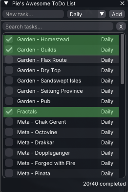

# Pie Todo – Raidcore Nexus Addon

A Guild Wars 2 addon for [Raidcore Nexus](https://raidcore.gg/Nexus) to help track your daily and weekly gameplay in Guild Wars 2.



## AI Notice

This addon has been 100% created in [Windsurf](https://windsurf.com/) using Claude. I understand that some folks have a moral, financial or political objection to creating software using an LLM. I just wanted to make a useful tool for the GW2 community, and this was the only way I could do it.

If an LLM creating software upsets you, then perhaps this repo isn't for you. Move on, and enjoy your day.

## Features

- **Tasks**: Add, edit, delete, with drag&drop sorting. 
- **Repeat**: Daily (midnight GMT) or Weekly (Monday 07:30 GMT)
- **Completed**: completed tasks can be coloured or optionally hidden until reset
- **Resets**: Daily / Weekly tasks automatically reset at the same time as Guild Wars 2
- **Persistence**: `todos.json` in the addon folder

## Build

### Linux (cross-compile to Windows .dll)

Install MinGW-w64:

```bash
# Arch
sudo pacman -S mingw-w64-gcc

# Ubuntu / Debian
sudo apt install mingw-w64

# Fedora
sudo dnf install mingw64-gcc-c++
```

```bash
mkdir build && cd build
cmake ..
make -j$(nproc)
```

Output: `build/PieTodo.dll`. Copy into Nexus’s addons folder.

## License

This software is provided as-is, without a warranty of any kind. Use at your own risk. It might delete your files, melt your PC, burn your house down, or cause world peace. Probably not that last one, but one can hope.